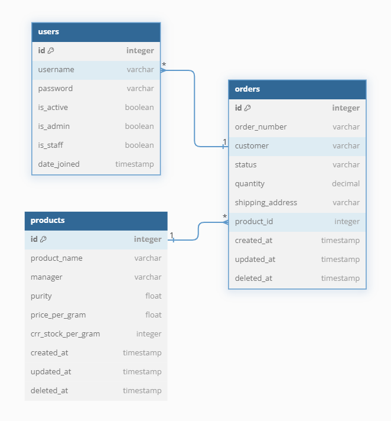

# Gold Rush

#### ** 금방주식회사 백엔드 입사과제 **

[[원티드 백엔드 프리온보딩 인턴십]](https://www.wanted.co.kr/events/pre_ob_be_1_seoul) - 기업 실무 프로젝트 3차 과제

> 언어 및 프레임워크 : Python 3.10 & Django 5.0, DRF 3.15
> RDBMS : Mariadb \
> ETC Tools : Git & Github, Notion, Discord

- 기간: 24.09.04 ~ 24.09.11

<br>

**목차**

1. [프로젝트 소개](#프로젝트-소개)
2. [프로젝트 구조 및 설계](#프로젝트-구조-및-설계)
3. [주요 기능](#주요-기능)
4. [API 명세서](#API-명세서)

<br>

## 프로젝트 소개

금을 판매하고 구매하는 서비스입니다.
인증을 담당하는 서버가 별도로 구축되어 있습니다.

## 프로젝트 구조 및 설계

### ERD



### 디렉토리 구조

<details>
<summary>Directory Structure</summary>
<div markdown="1">

```
gold_rush/
│  .env
│  LICENSE
│  Pipfile
│  Pipfile.lock
│  README.md
│
├─.github
│  └─ISSUE_TEMPLATE
│          issue--custom-issue-template.md
│          pull_request_template.md
│
├─auth_server
│  │  manage.py
│  │
│  ├─config
│  │      asgi.py
│  │      authentication.py
│  │      settings.py
│  │      urls.py
│  │      wsgi.py
│  │      __init__.py
│  │
│  └─user
│      │  apps.py
│      │  auth.py
│      │  urls.py
│      │  __init__.py
│      │
│      ├─admin
│      │      user_admin.py
│      │      __init__.py
│      │
│      ├─migrations
│      │      0001_initial.py
│      │      __init__.py
│      │
│      ├─models
│      │      user.py
│      │      __init__.py
│      │
│      ├─serializers
│      │      user_register_serializer.py
│      │      user_token_obtain_serializer.py
│      │      __init__.py
│      │
│      ├─tests
│      │      __init__.py
│      │
│      └─views
│              user_login_view.py
│              user_logout_view.py
│              user_refresh_token_view.py
│              user_register_view.py
│              user_verify_view.py
│              __init__.py
│
└─resource_server
    │  manage.py
    │  utils.py
    │
    ├─config
    │      asgi.py
    │      authentication.py
    │      models.py
    │      pagination.py
    │      settings.py
    │      urls.py
    │      wsgi.py
    │      __init__.py
    │
    ├─order
    │  │  apps.py
    │  │  permissions.py
    │  │  tests.py
    │  │  urls.py
    │  │  __init__.py
    │  │
    │  ├─admin
    │  │      order_admin.py
    │  │      __init__.py
    │  │
    │  ├─migrations
    │  │      0001_initial.py
    │  │      __init__.py
    │  │
    │  ├─models
    │  │      order.py
    │  │      __init__.py
    │  │
    │  ├─serializers
    │  │      order_detail_serializer.py
    │  │      order_list_serializer.py
    │  │      __init__.py
    │  │
    │  ├─tests
    │  │      __init__.py
    │  │
    │  └─views
    │          order_detail_view.py
    │          order_list_view.py
    │          __init__.py
    │
    └─product
        │  apps.py
        │  permissions.py
        │  urls.py
        │  __init__.py
        │
        ├─admin
        │      product_admin.py
        │      __init__.py
        │
        ├─migrations
        │      0001_initial.py
        │      __init__.py
        │
        ├─models
        │      product.py
        │      __init__.py
        │
        ├─serializers
        │      product_serializer.py
        │      __init__.py
        │
        ├─tests
        │      __init__.py
        │
        └─views
                product_detail_view.py
                product_list_view.py
                __init__.py


```

</div>
</details>

### Setting Guide

- 루트 디렉토리에 `.env` 밑처럼 세팅

```
AUTH_SERVER_SECRET_KEY=auth_key
RESOURCE_SERVER_SECRET_KEY=resource_key

DB_NAME=your_database_name
DB_USER=your_database_user
DB_PASSWORD=your_database_password
DB_HOST=localhost
DB_PORT=3306
```

```
-- 명령 프롬프트 두 개 세팅

-- 프로젝트 경로로 이동
cd [프로젝트 경로]

-- pipenv 설치
pipenv install
pipenv install --dev

-- 가상 환경 on
pipenv shell

-- 인증 서버로 이동 및 실행
cd auth_server
python manage.py runserver

-- 자원 서버로 이동 및 실행
cd resource_server
python manage.py runserver 5000

-- 가상환경 중지
exit
```

## 주요 기능

- **회원가입 및 인증**: 계정 생성, JWT를 통한 인증 및 보안 유지.
- **금 구매**: 자원 서버에서 금 구매 가능

## API 명세서

swagger 참조
